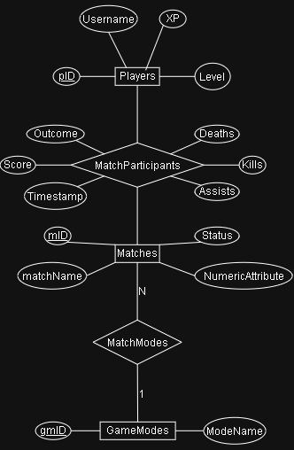

# ex603-game-telemetry-database

Theme: Game Telemetry

This project will exhibit an example of a game telemetry database that collects, analyzes, and utilizes data of a video game about the players, the matches, and the participants (including, but not limited, to the aforementioned players) and their scores, the game and match modes, for each match (mainly upon their conclusion).

## Domain

For the project, there are six domains that it could take the form of, all sharing the underlying structure of five rows: actor, producer, event, catalog, and junction, alongside a numeric metric.  The domain that I chose for mine is Game Telemetry, where the player serves as an actor, the match serves as the producer, match participants serves as an event, game modes serve as a catalog, match modes serve as the junction, and score serves as the metric.  The reason I chose this domain is because I have a passion for video games, as I have played a wide variety of their genres, including (but not limited to) adventure, FPSes, puzzles, racing, and strategy games.

Although I am more into single-player games, I have also played (competitive) multiplayer games, such as Call of Duty.  In the case of my project, I will emulate a game telemetry database of a competitive online multiplayer FPS game, since I have always believed that no games of that kind is complete without it.  By creating the project, I am looking forward to answer how the data is collected and managed by that game, given that I should be familiar with data management subjects since my years as an undergraduate.
